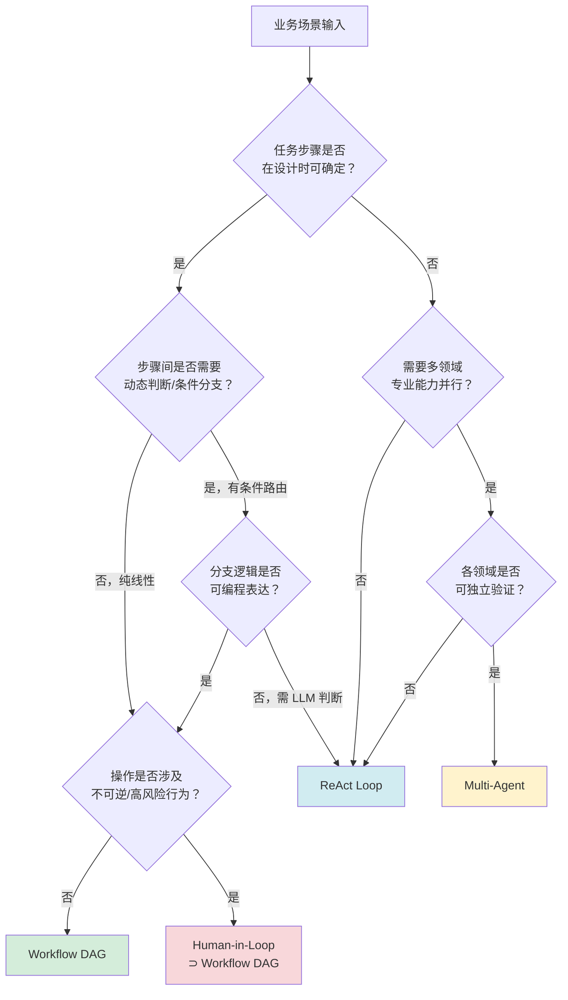
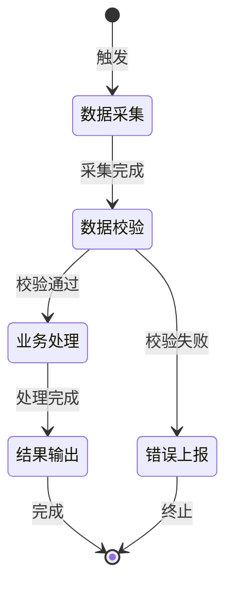
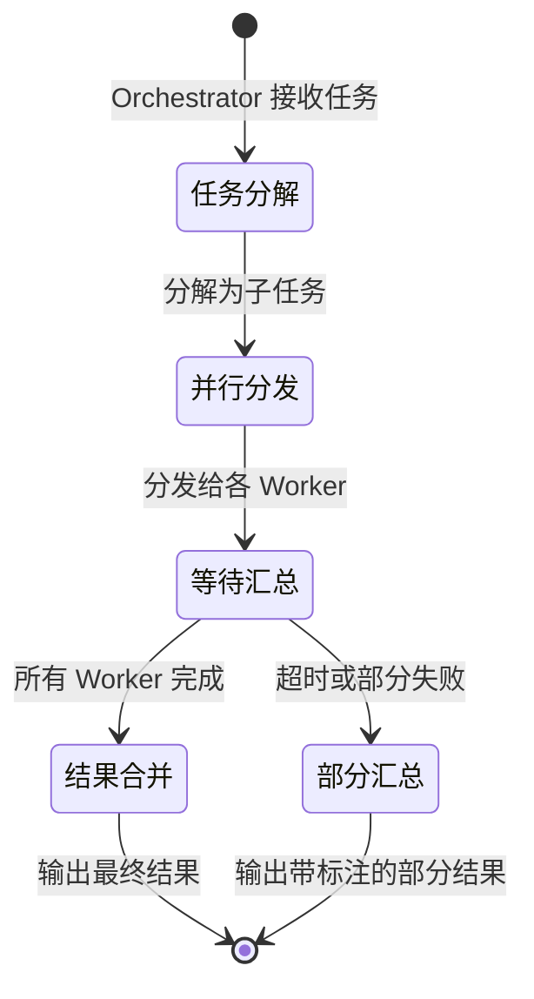
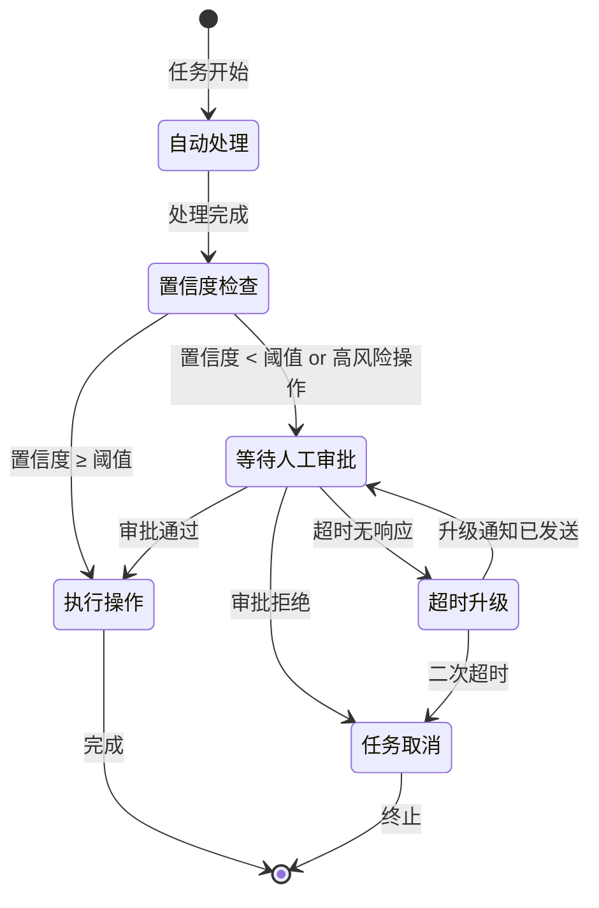

# Agent 架构模式选型指南

在执行 `/design-agent` 的 Step 3 时加载本文件。基于业务特征系统化选型，不得凭直觉猜测。

---

## 四种架构模式概览

| 模式 | 核心特征 | 适用场景 | 复杂度 | 典型工具数 | 延迟量级 |
|------|---------|---------|--------|-----------|---------|
| **Workflow DAG** | 步骤固定、有向无环 | 流水线处理、报告生成 | 低 | 3-8 | 秒级 |
| **ReAct Loop** | 推理-行动循环、动态决策 | 问题诊断、信息检索 | 中 | 5-10 | 秒-分钟级 |
| **Multi-Agent** | 多智能体协作分工 | 多领域并行、大规模任务 | 高 | 每 Agent 3-8 | 分钟级 |
| **Human-in-Loop** | 含人工审批节点 | 高风险操作、置信度不足 | 中-高 | 3-8 + 通知工具 | 分钟-小时级 |

---

## 选型决策树



**快速判断口诀**：
- 步骤确定 → DAG；步骤不确定 → ReAct
- 需要多专家 → Multi-Agent；需要人审批 → Human-in-Loop
- 不确定时，首选 Workflow DAG，验证后再升级

---

## 模式 1：Workflow DAG（工作流有向无环图）

### 定义

将业务流程分解为有序的原子步骤，每步工具调用固定，步骤间有向无环。Agent 的决策空间受限于预定义的执行路径。

### Harness 象限要求

- **任务清晰度** ≥ 4：目标明确，步骤可枚举
- **验证自动化程度** ≥ 3：每步输出可程序验证
- 最适合右上象限（高清晰度 × 高可验证）

### 状态机模板



### 工具链约束

- 每步工具调用**结果确定**（相同输入产生相同输出结构）
- 工具按步骤分组，不同步骤的工具不应重叠
- 每步工具必须有明确的"成功"和"失败"判断标准

### ✅ 好案例：发票自动处理

```
场景：上传发票 → OCR 识别 → 金额校验 → 记账写入 → 通知审批人
为什么适合 DAG：步骤固定、每步可验证、顺序依赖明确
工具：extract_invoice_data, validate_amount, write_accounting_entry, notify_approver
```

### ❌ 坏案例：客服问题处理

```
场景：用户问题 → 分类 → 处理
为什么不适合 DAG：问题分类后的处理路径不确定，Agent 需要根据内容动态决策
应该用：ReAct Loop
```

### 升级信号 → ReAct Loop

当出现以下情况时，DAG 应升级为 ReAct：
- 步骤间的分支条件依赖 LLM 推理（不是程序判断）
- 任务失败后需要动态选择替代路径
- 工具调用序列在运行时才能确定

---

## 模式 2：ReAct Loop（推理-行动循环）

### 定义

Agent 在每步行动前先推理（Reasoning），行动后观察结果（Observation），再决定下一步。执行路径在运行时动态形成，不预先固定。

### Harness 象限要求

- **任务清晰度** ≥ 3：目标清晰，但路径不预知
- **验证自动化程度** ≥ 2：终态可验证，中间步骤允许灵活
- 适合右上象限和右下象限（目标清晰但路径动态）

### ReAct 循环结构

```
Thought: 当前状态是什么？下一步应该做什么？
Action: 调用工具 X，参数 Y
Observation: 工具返回了 Z
Thought: 根据 Z，下一步应该...
[循环直到目标达成或达到终止条件]
```

### 工具链对 description 的更高要求

ReAct 模式下 Agent 自主选择工具，description 质量直接决定选择准确率。**每个工具的 description 必须包含：**
- 在 ReAct 流程中的定位（"用于探索阶段"、"用于确认阶段"）
- 与相似工具的区分（"与 search_documents 不同，本工具只检索标题"）
- 结果如何影响后续决策（"返回置信度 < 0.7 时应尝试 search_with_broader_query"）

### 终止条件（必须显式设计）

```
成功终止：[具体的目标达成判断，避免模糊的"任务完成"]
失败终止：
  - 最大循环次数：10 次（根据场景调整）
  - 最大耗时：60 秒
  - 不可恢复错误：Auth 类错误直接终止
优雅降级：部分完成 + 说明已完成内容 + 剩余工作交人工
```

### ✅ 好案例：代码 Bug 诊断

```
场景：给定错误日志，定位根因并建议修复
为什么适合 ReAct：诊断路径动态（可能需要看日志→看代码→看配置→再回看日志）
工具：search_logs, read_file, check_config, run_test
终止条件：找到根因并提供修复建议，或探索 10 次仍未定位时上报
```

### ❌ 坏案例：数据库数据迁移

```
场景：从表 A 迁移数据到表 B，转换字段格式
为什么不适合 ReAct：步骤完全确定，用 ReAct 引入不必要的不确定性
应该用：Workflow DAG（步骤固定：读取→转换→写入→验证）
```

### 升级信号 → Multi-Agent

- 工具集超过 10 个
- 不同工具属于完全不同的业务域
- 某些工具需要不同的安全权限边界

---

## 模式 3：Multi-Agent（多智能体协作）

### 定义

由一个 Orchestrator Agent 协调多个专职 Worker Agent。每个 Worker 在自己的专业域内独立运作，Orchestrator 负责任务分发和结果汇总。

### 引入 Multi-Agent 的三个合法理由

引入 Multi-Agent 会显著增加系统复杂度，**必须满足以下至少一条**：

1. **并行加速**：多个子任务可同时执行，且有明确的时间收益（如并行生成多语言内容）
2. **专业分工**：不同子任务需要本质上不同的能力集或工具集（如代码分析 Agent + 文档生成 Agent）
3. **故障隔离**：某个子任务失败不应影响其他子任务（如各区域销售报告独立生成）

**不合法理由**：
- "看起来更清晰"（架构清晰 ≠ 多 Agent）
- "单 Agent 太复杂"（先尝试减少工具数量）
- "参考了某个 Multi-Agent 示例"（抄架构不是理由）

### Harness 象限要求

- 每个 Worker Agent 独立满足 Harness 要求（分别评估象限）
- Orchestrator 本身的任务清晰度 ≥ 4（协调逻辑不能模糊）

### Orchestrator-Worker 模板



### Worker 设计约束

- 每个 Worker 工具集 ≤ 8 个，且工具之间**不应跨 Worker 重叠**
- Worker 之间不直接通信，只通过 Orchestrator 中转
- Worker 的输出格式**必须固定**，供 Orchestrator 解析

### ✅ 好案例：多语言产品说明生成

```
场景：同一产品，生成中/英/日三语版本
Orchestrator：接收产品信息，并行分发给三个 Worker
Worker_ZH / Worker_EN / Worker_JA：各自独立生成，互不干扰
为什么合适：真实并行（节省 3x 时间）+ 故障隔离（一语失败不影响另两语）
```

### ❌ 坏案例：将简单 CRUD 拆成 3 个 Agent

```
场景：用户注册流程 → 校验 Agent + 创建 Agent + 通知 Agent
为什么不合适：步骤顺序严格依赖（校验 → 创建 → 通知），无并行可能，协调开销远大于收益
应该用：Workflow DAG（3 步线性流水线）
```

### 反模式警示

- **AP-4 上下文膨胀**：Orchestrator 将所有 Worker 结果拼入上下文会导致 token 爆炸，Worker 输出必须是摘要而非全文
- **AP-7 多 Agent 失控**：没有合法理由就引入多 Agent，是最常见的过度设计反模式

---

## 模式 4：Human-in-Loop（人机协同）

### 定义

在 Agent 自动执行流程中，在关键节点暂停等待人工决策或确认，再继续执行。人工参与是**架构设计的组成部分**，不是系统的退化。

### 适用场景：何时人工节点是必要的

- **高风险不可逆操作**：资金划转、账户注销、生产环境变更
- **置信度不足**：Agent 判断结果置信度 < 阈值（需明确定义阈值）
- **法律/合规要求**：必须有人工审批记录
- **验证无法自动化**：创意质量判断、客户情感判断

### 不适用场景

- 纯粹因为"不信任 Agent"（应该先提升 Harness 定义质量）
- 所有步骤都加审批（等于没有自动化）

### HITL 节点设计三要素

**1. 触发条件（何时暂停）**

```
明确触发条件，避免"感觉不对就问人"：
- 置信度阈值：分类置信度 < 0.85
- 操作类型：涉及金额 > 1000 元的任何操作
- 异常信号：连续失败 2 次
- 定期确认：每处理 100 条记录确认一次
```

**2. 超时策略（人工未响应时）**

```
必须设计默认动作，不能无限等待：
- 超时时长：[场景决定，通常 4-24 小时]
- 默认动作：取消操作 / 升级给上级 / 保留到下一工作日
- 升级路径：超时 → 通知备选审批人 → 超时 → 自动取消
```

**3. 信息呈现（Agent 向人展示什么）**

```
人工节点的信息必须支持快速决策：
- 当前上下文：已完成的步骤和结果
- 待决策内容：明确的二选一或多选项（不是自由文本）
- 风险说明：选择各项的后果
- 建议选项：Agent 的推荐（含置信度）
```

### 状态机模板（含 HITL 节点）



### ✅ 好案例：合同审批 Agent

```
场景：自动起草合同 → 法务审批 → 发送签署
HITL 节点：发送签署前等待法务审批（法规要求人工）
触发条件：固定节点（每次必须审批，非条件触发）
超时策略：48 小时内无响应 → 通知法务主管 → 72 小时仍无响应 → 升级 CEO
信息呈现：合同摘要 + 关键条款 + 风险提示 + [批准]/[退回修改] 按钮
```

### ❌ 坏案例：每次工具调用前都问用户

```
场景：每次调用 API 前确认
问题：等同于手动操作，自动化价值归零
应该用：在任务开始前一次性确认范围，执行时不打扰
```

---

## 模式组合速查

| 组合 | 适用场景 | 说明 |
|------|---------|------|
| DAG + Human-in-Loop | 有固定流程但含人工审批节点 | 最常见组合，适合合规场景 |
| ReAct + Human-in-Loop | 动态探索后等人工决策 | 适合诊断+修复类场景 |
| Multi-Agent + DAG | 多个 Worker 各自执行固定流程 | 适合批量处理不同类型任务 |
| Multi-Agent + ReAct | Orchestrator 动态协调各 Worker | 高复杂度，谨慎使用 |

---

## 选型输出模板

对应 SKILL.md 输出格式第 3 节，填写时引用决策树路径：

```markdown
## 3. 架构模式

**选型**：[Workflow DAG / ReAct Loop / Multi-Agent / Human-in-Loop]

**决策路径**：
- 任务步骤 [是/否] 可在设计时确定 → [DAG 候选 / ReAct 候选]
- [后续判断节点及结论]

**选型理由**：[为什么这个模式满足当前场景的核心需求]

**不选其他模式的理由**：
- 不选 Workflow DAG：[具体原因，或"不适用"]
- 不选 ReAct Loop：[具体原因，或"不适用"]
- 不选 Multi-Agent：[具体原因，或"不适用"]
- 不选 Human-in-Loop：[具体原因，或"不适用"]

**[ASSUMPTION]**：[本次选型依赖的未经证实的假设]
```
