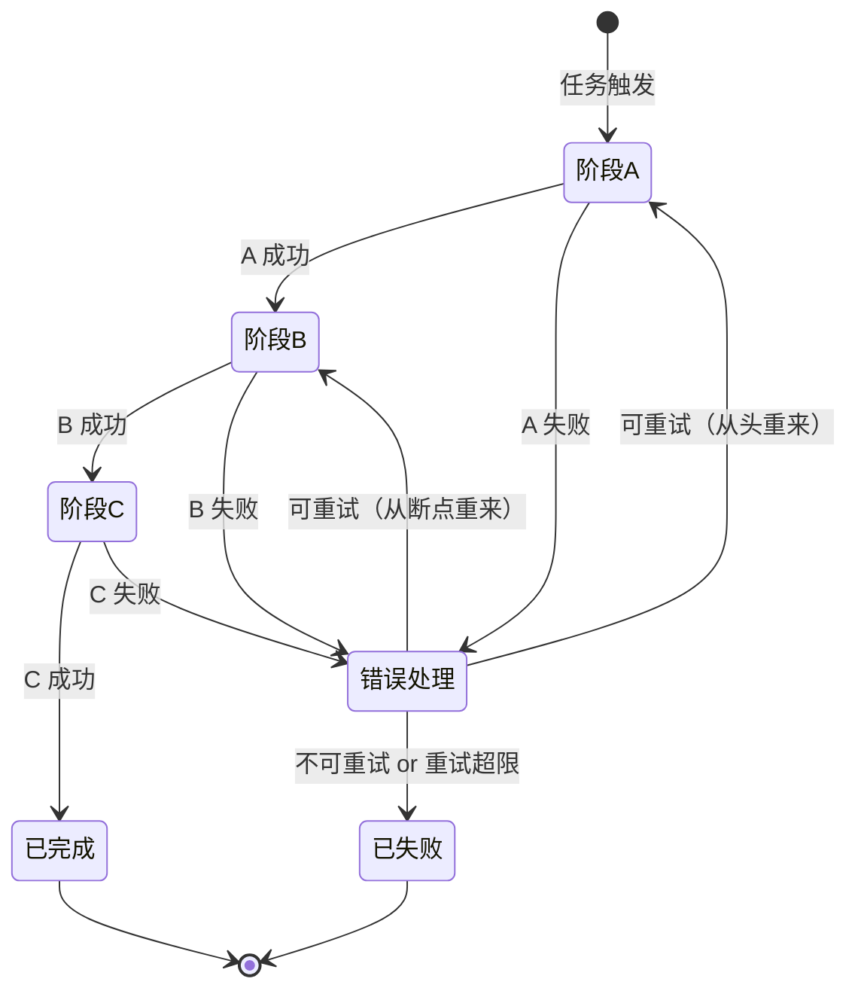
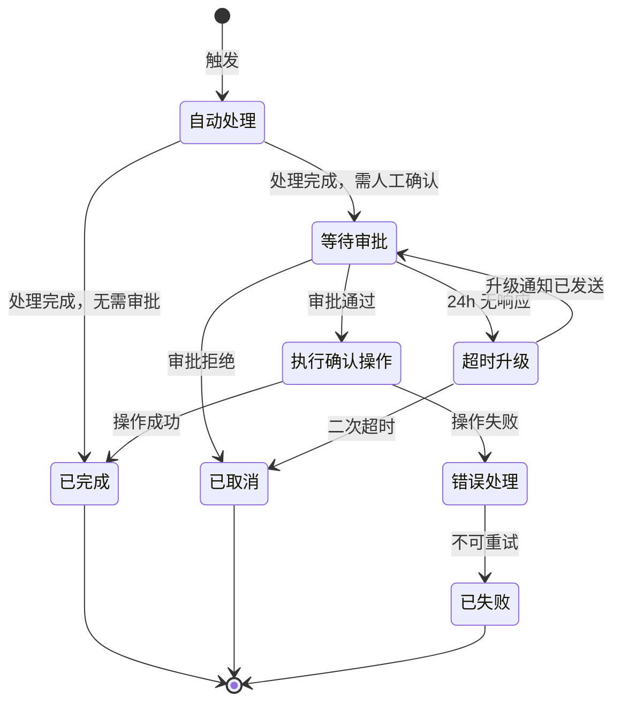
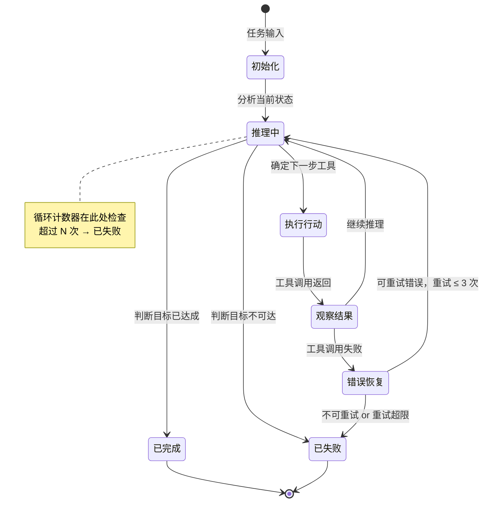
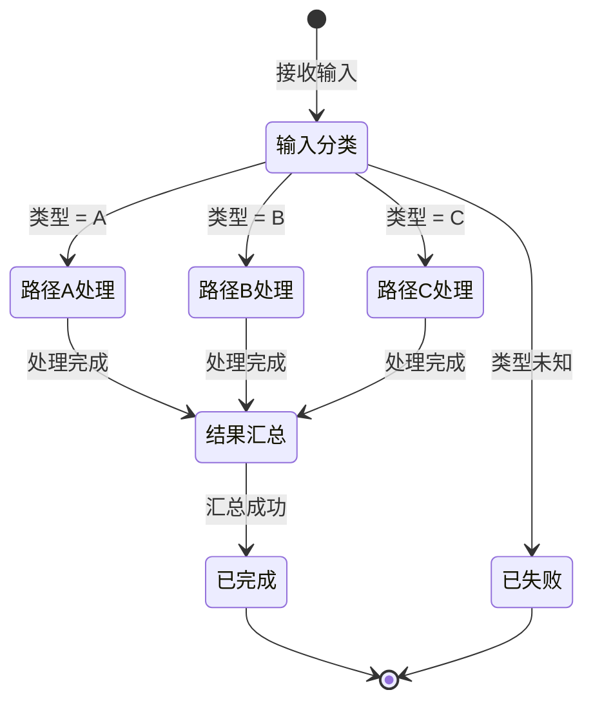
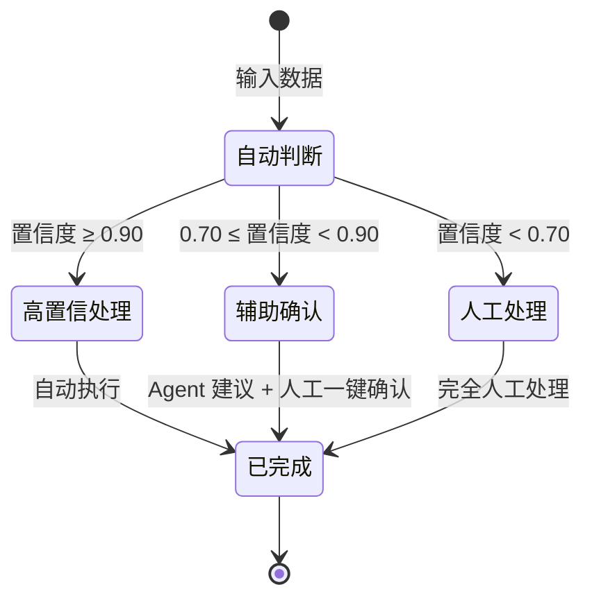
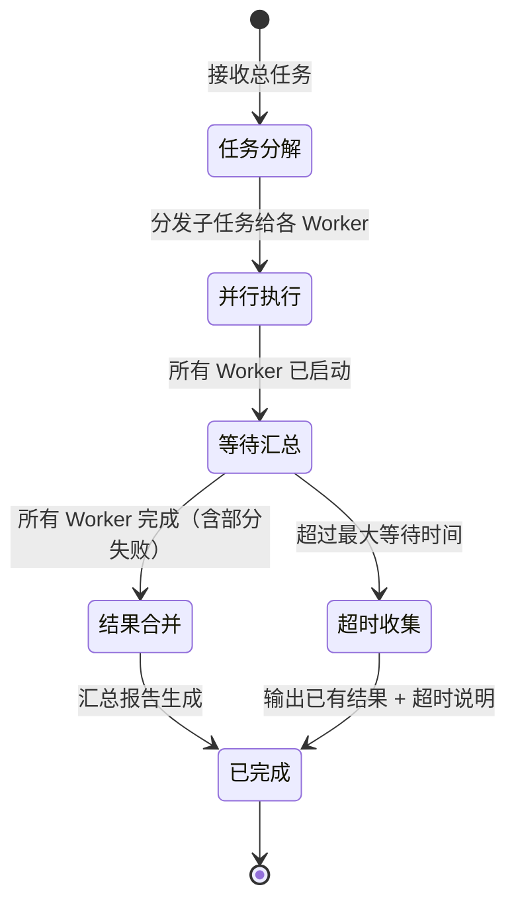
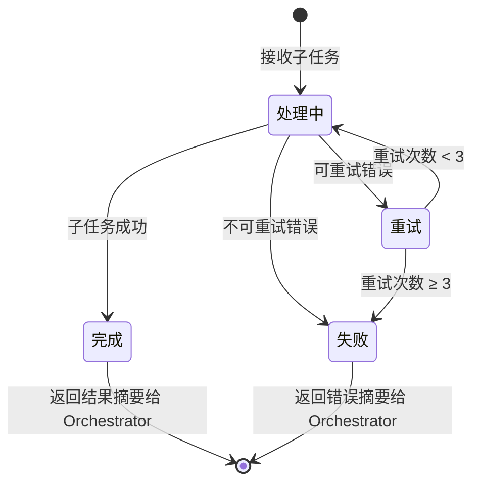
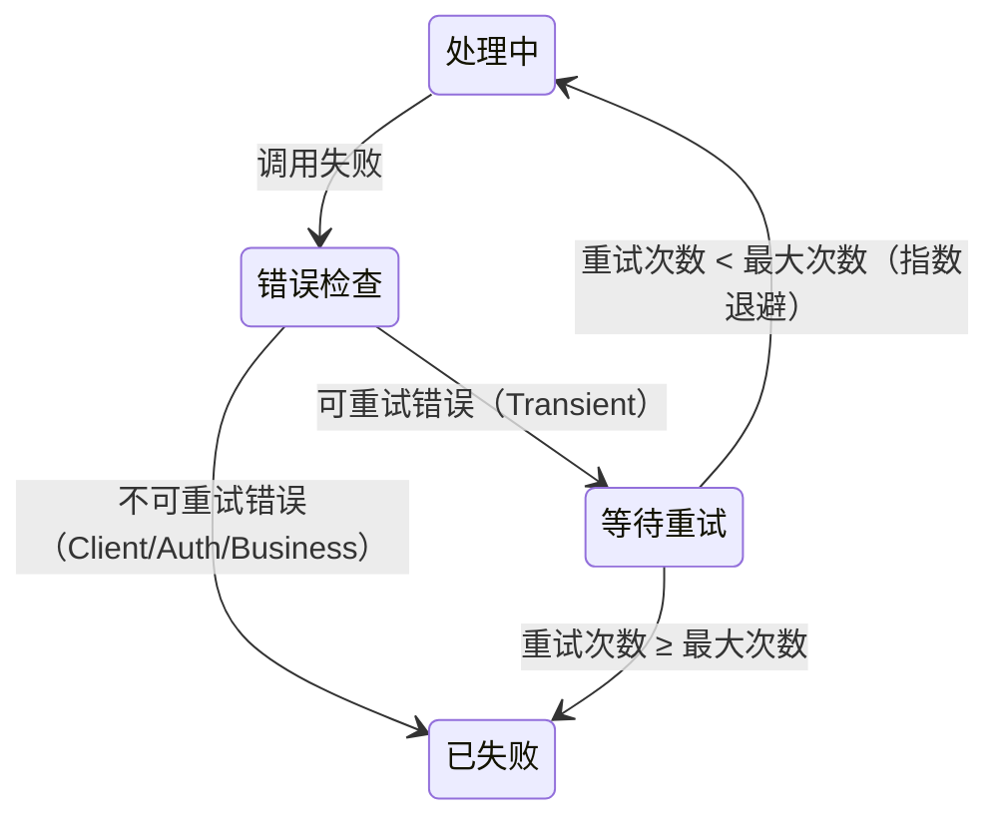
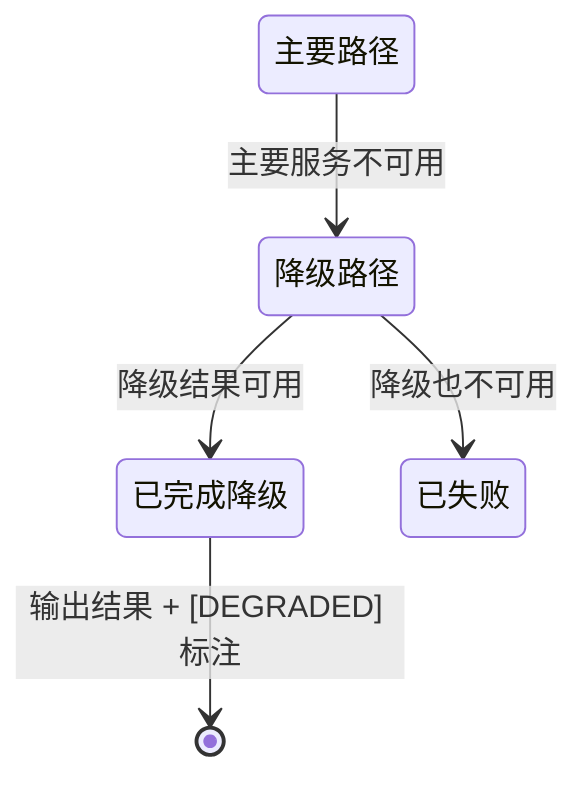
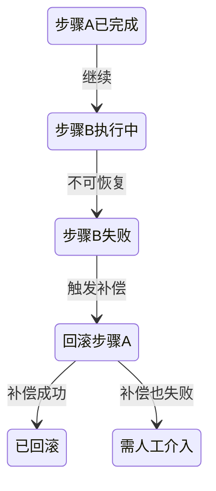

# 状态机设计模式库

在执行 `/design-agent` 输出第 5 节"状态机/工作流"时加载本文件。根据已选定的架构模式，选择对应的状态机模板，替换占位符。

---

## 状态机设计原则

### 命名规范

```
状态名 = 名词 or 形容词（描述系统当前所处的状态）
  ✅ 等待用户输入、数据处理中、审批待定、操作已完成
  ❌ 步骤1、run_step、processing（过于技术化）

转换标签 = 动词短语 or 条件表达式（描述触发转换的事件/条件）
  ✅ 用户提交、校验通过、超时触发、重试次数 ≥ 3
  ❌ next、go、ok
```

### 数量约束

| 场景 | 推荐状态数 | 上限 |
|------|-----------|------|
| 单 Agent Workflow DAG | 4-8 | 12 |
| 单 Agent ReAct Loop | 3-5 | 8 |
| Multi-Agent（每个 Agent） | 3-6 | 10 |
| Human-in-Loop（含 HITL 节点） | 5-9 | 12 |

> **超过上限信号**：状态数 > 12 → 考虑拆分子状态机或引入子 Agent

### 四类必备状态（不可省略）

1. **初始状态**：任务的唯一入口
2. **成功终态**：至少一个，明确定义"成功"的含义
3. **失败终态**：至少一个，包含不可恢复错误的出口
4. **错误恢复状态**：处理可重试错误的中间状态（不能只有 happy path）

---

## 模式 1：线性流水线（对应 Workflow DAG）

### 适用场景

步骤顺序固定、无动态分支、每步成功才能进入下一步。

### 标准模板



### 状态说明表模板

| 状态 | 进入条件 | 退出条件（成功） | 退出条件（失败） | 超时处理 |
|------|---------|----------------|----------------|---------|
| 阶段A | 任务触发 | [具体成功标准] | [错误类型] | [秒数] → 错误处理 |
| 阶段B | A 成功 | [具体成功标准] | [错误类型] | [秒数] → 错误处理 |
| 阶段C | B 成功 | [具体成功标准] | [错误类型] | [秒数] → 错误处理 |

### 变体：含人工审批节点的线性流水线



---

## 模式 2：循环状态机（对应 ReAct Loop）

### 适用场景

Agent 需要反复推理和行动，直到达成目标。执行次数不确定，但终止条件明确。

### Think-Act-Observe 循环模板



### 终止条件设计（必填）

```
【成功终止】
条件：[具体可检测的目标达成标准，避免"感觉完成了"]
示例：找到根因且验证建议可行 / 所有字段均已填写且通过校验

【失败终止】
条件1 - 循环上限：最大执行 [N] 次推理-行动循环（建议 8-15 次）
条件2 - 时间上限：总执行时间 > [T] 秒/分钟
条件3 - 不可恢复错误：Auth 错误、业务规则硬约束触发

【优雅降级】
部分完成时：输出已完成部分 + 剩余工作说明 + 建议人工接手位置
```

### 循环保障机制

在工具设计时，ReAct Loop 必须预防无限循环：

```
工具返回值规范（ReAct 专用）：
- 每次调用必须返回"是否距目标更近"的信号
- 陷入循环的信号：连续 3 次观察结果相同 → 强制终止

Agent 角色约束（System Prompt）：
- "如果连续 3 次行动没有新发现，停止并报告当前进展"
- "达到 [N] 次循环时，即使未完成也输出最优部分结果"
```

---

## 模式 3：分支状态机（对应条件路由）

### 适用场景

输入类型或中间结果决定后续处理路径，但每条路径内部是确定的。

### 类型路由模板



### 置信度路由模板



### 分支设计原则

- 分支条件必须**互斥且完备**（避免同一输入匹配多个分支或没有分支）
- 每条分支必须有**独立的错误处理**（不共享错误处理状态）
- 分支数量建议 ≤ 5；超过 5 个分支考虑重构为两层路由

---

## 模式 4：嵌套状态机（对应 Multi-Agent）

### 适用场景

Orchestrator 管理多个 Worker，每个 Worker 有独立的状态机。

### Orchestrator 视角（外层状态机）



### Worker 视角（内层状态机，每个 Worker 独立）



### Worker 输出协议

Worker 向 Orchestrator 返回的内容必须是**摘要，不是全文**：

```json
{
  "worker_id": "worker_zh",
  "status": "completed",         // completed | failed | partial
  "result_summary": "中文版本已生成，共 800 字，通过质量检查",
  "artifacts": ["output_zh.md"], // 文件引用，不是内容
  "error": null
}
```

> **禁止**：Worker 将完整输出（长文本、大数据）放入返回值传给 Orchestrator，这会导致 Orchestrator 的 token 预算爆炸（AP-4 反模式）

---

## 异常路径设计

任何状态机都必须设计完整的异常路径，不能只有 happy path。

### 重试模式



**指数退避参数**：
- 首次重试：等待 1 秒
- 第 N 次重试：等待 min(2^N 秒, 30 秒)
- 最大重试次数：3 次（可根据场景调整）

### 降级模式



### 补偿模式（已完成步骤的回滚）

适用于分布式操作，部分步骤失败需要撤销已完成步骤：



---

## 状态机质量检查清单

输出状态机后，逐项验证：

- [ ] **所有状态可达**：从初始状态出发能到达每个状态（无孤立状态）
- [ ] **所有状态有出口**：不存在没有转换的非终态（无死锁）
- [ ] **错误路径完整**：每个状态都处理了异常情况（不只有 happy path）
- [ ] **终止条件明确**：每条路径都能到达终态，不存在无限循环可能
- [ ] **超时机制存在**：每个"等待"状态都有超时转换
- [ ] **状态数量合规**：单 Agent 状态数 ≤ 12，超出须重新设计
